# Graphviz

## What is Graphviz?

> Graphviz is open source graph visualization software. Graph visualization is a way of representing structural information as diagrams of abstract graphs and networks.

## What is DOT?

> Abstract grammar for defining Graphviz **nodes**, **edges**, **graphs**, **subgraphs**, and **clusters**.

## Get Started with JavaScript

Install dependency below.

```bash
yarn add @hpcc-js/wasm
```

Load graphviz and feed dot string to generate svg string.

```javascript
import { Graphviz } from '@hpcc-js/wasm/graphviz'

foo()

async function foo() {
  const graphviz = await Graphviz.load()
  const dot = 'digraph { a -> b }'
  const svg = graphviz.dot(dot)
  return svg
}
```

The `svg` variable is a generated html string like below.

```html
<?xml version="1.0" encoding="UTF-8" standalone="no"?>
<!DOCTYPE svg PUBLIC "-//W3C//DTD SVG 1.1//EN" "http://www.w3.org/Graphics/SVG/1.1/DTD/svg11.dtd">
<!-- Generated by graphviz version 7.0.1 (20221113.1944)
 -->
<!-- Pages: 1 -->
<svg
  width="62pt"
  height="116pt"
  viewBox="0.00 0.00 62.00 116.00"
  xmlns="http://www.w3.org/2000/svg"
  xmlns:xlink="http://www.w3.org/1999/xlink"
>
  <g
    id="graph0"
    class="graph"
    transform="scale(1 1) rotate(0) translate(4 112)"
  >
    <polygon
      fill="white"
      stroke="none"
      points="-4,4 -4,-112 58,-112 58,4 -4,4"
    />
    <!-- a -->
    <g id="node1" class="node">
      <title>a</title>
      <ellipse fill="none" stroke="black" cx="27" cy="-90" rx="27" ry="18" />
      <text
        text-anchor="middle"
        x="27"
        y="-85.8"
        font-family="Times,serif"
        font-size="14.00"
      >
        a
      </text>
    </g>
    <!-- b -->
    <g id="node2" class="node">
      <title>b</title>
      <ellipse fill="none" stroke="black" cx="27" cy="-18" rx="27" ry="18" />
      <text
        text-anchor="middle"
        x="27"
        y="-13.8"
        font-family="Times,serif"
        font-size="14.00"
      >
        b
      </text>
    </g>
    <!-- a&#45;&gt;b -->
    <g id="edge1" class="edge">
      <title>a&#45;&gt;b</title>
      <path
        fill="none"
        stroke="black"
        d="M27,-71.7C27,-64.41 27,-55.73 27,-47.54"
      />
      <polygon
        fill="black"
        stroke="black"
        points="30.5,-47.62 27,-37.62 23.5,-47.62 30.5,-47.62"
      />
    </g>
  </g>
</svg>
```

Render it through modern front-end framework (ex: vue)

```html
<div v-html="svg" />
```

or call graphviz api to bind api

```javascript
const div = document.getElementById('placeholder')
div.innerHTML = graphviz.layout(dot, 'svg', 'dot')
```

Harray! You get a simple direct graph!


There are some other layout programs to choose, check [this](<https://www.wikiwand.com/en/DOT_(graph_description_language)#Layout_programs>) out.

## Attributes

### label

Text label attached to objects

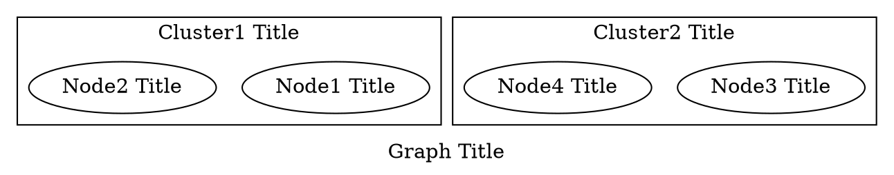


### labelloc

Vertical placement of labels for nodes, root graphs and clusters
type: `string`, default: `t` (clusters) , `b` (root graphs) , `c` (nodes)

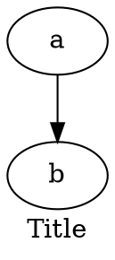


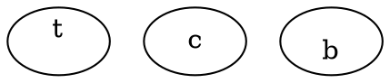


### xlabel

External label for a node or edge

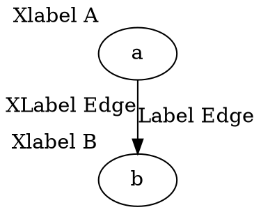


### fontcolor

Color used for text

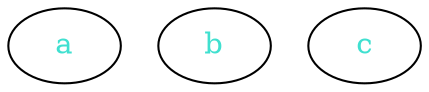


### color

Basic drawing color for graphics, not text

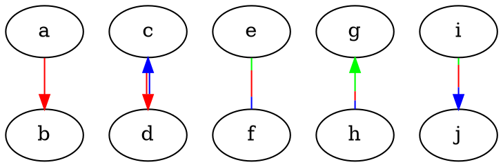


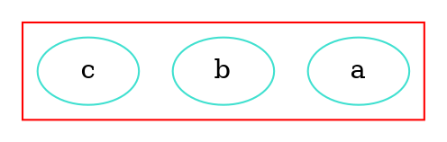


### style

Set style information for components of the graph

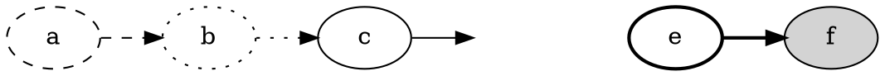


### nodesep

In dot, nodesep specifies the minimum space between two adjacent nodes in the same rank, in inches
type: `double`, default: `0.25`, minimum: `0.02`

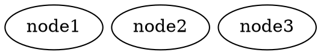

| 0.1                                          | 0.5                                          |
| -------------------------------------------- | -------------------------------------------- |
|  |  |

### rankdir

Set direction of graph
type: `rankdir` (`TB`, `BT`, `RL` or `LR`), default: `TB`

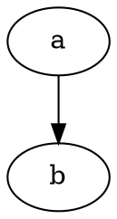

| TB                                           | BT                                           | LR                                           | RL                                           |
| -------------------------------------------- | -------------------------------------------- | -------------------------------------------- | -------------------------------------------- |
|  |  |  |  |

## Node Shapes

There are three main types of shapes : polygon-based, record-based and user-defined.

### Polygon-based Nodes

#### shape

the shape of a node

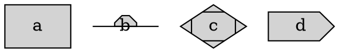


#### width

Width of node, in inches
type: `double`, default: `0.75`, minimum: `0.01`

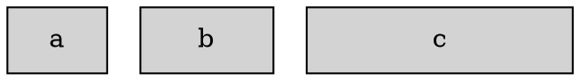


#### height

Height of node, in inches
type: `double`, default: `0.5`, minimum: `0.02`

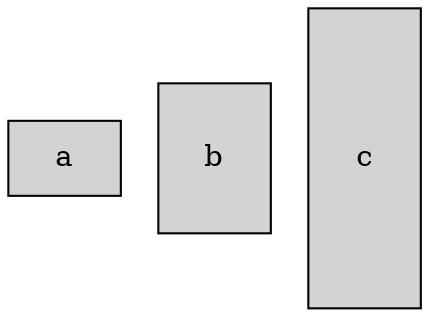


### Record-based Nodes

```dot
digraph {
    node [shape=record];
    struct1 [label="<f0> left|<f1> mid&#92; dle|<f2> right"];
    struct2 [label="<f0> one|<f1> two"];
    struct3 [label="hello&#92;nworld |{ b |{c|<here> d|e}| f}| g | h"];
    struct1:f1 -> struct2:f0;
    struct1:f2 -> struct3:here;
}
```


## Reference

- [Graphviz](https://www.graphviz.org/)
- [wikipedia - Graphviz](https://zh.wikipedia.org/zh-tw/Graphviz)
- [wikipedia - DOT Language](https://zh.wikipedia.org/zh-tw/DOT%E8%AF%AD%E8%A8%80)
- [wikiwand - DOT Language](<https://www.wikiwand.com/en/DOT_(graph_description_language)#introduction>)
- [@hpcc-js/wasm](https://hpcc-systems.github.io/hpcc-js-wasm/)
- [codesandbox - dag-viewer-forked-tv5dd](https://codesandbox.io/s/dag-viewer-forked-tv5dd)
- [codesandbox - dag-viewer-forked-wl185q](https://codesandbox.io/s/dag-viewer-forked-wl185q?file=/package.json:138-149)
- [Graphviz Visual Editor](http://magjac.com/graphviz-visual-editor/)

###### tags: `Work` `Graphviz` `DOT`
